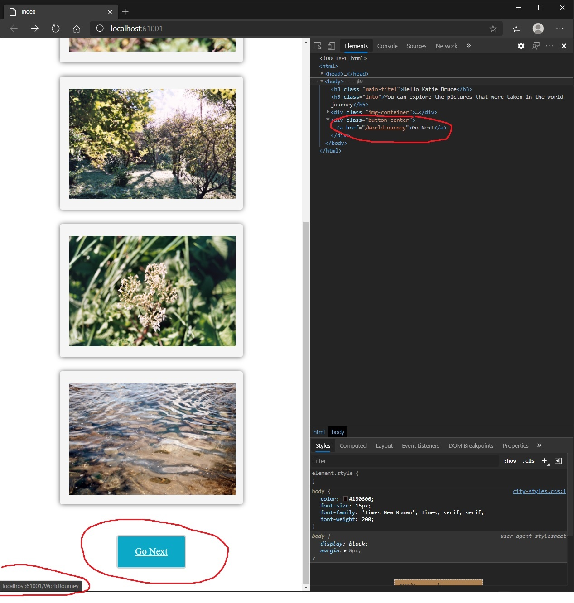
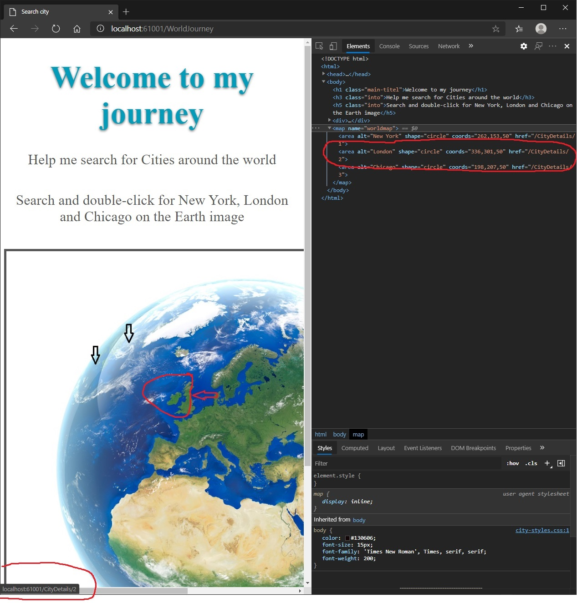

# Module 4: Developing Controllers

## Lab: Developing Controllers

1. **Nombres y apellidos:** Francisco Javier Moreno Quevedo
2. **Fecha:** 06/12/2020
3. **Resumen del Ejercicio:**  Añadir los componentes necesarios para hacer funcional la aplicacion de viajes 3/4
4. **Dificultad o problemas presentados y como se resolvieron:** Ninguna

- Ejercicio 3: Configuring Routes by Using Attributes

  - Decoramos la accion Index del controlador CityController con una ruta
  
  - Decoramos la accion details del controlador CityController con una ruta
  
    
  
  

